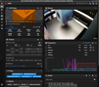

# Klipper Mod for Flashforge Adventurer 5M (Pro)

This is an unofficial mod to run Moonraker, custom Klipper, Mainsail & Fluidd on the Flashforge ADM5 (Pro) 3D printers and unlock the full power of open source software.

*This mod is currently in beta stage.* Many features are implemented already but they need to be tested thoroughly and polished a bit by early adopters.

Klipper Mod for the ADM5 is designed to be fully removable and not break any functions of the stock software. But if you install it, then please be aware, that you risk to loose your warranty or damage the printer. *Proceed at your own risk if you want to use this mod!*

## Feature Overview
- [Klipper](https://www.klipper3d.org/) 0.11 -- with improved configuration and default macros
- [Moonraker](https://github.com/Arksine/moonraker) on port 7125
- [Mainsail](https://docs.mainsail.xyz/) on port 4000
- [Fluidd](https://docs.fluidd.xyz/) on port 4001
- [KlipperScreen](https://klipperscreen.readthedocs.io/en/latest/) -- separate preview build
- Camera streaming via [ustreamer](https://github.com/pikvm/ustreamer) on port 8080
- Network access: Ethernet LAN and WiFi via [iwd](https://iwd.wiki.kernel.org/)
- Customized Linux environment based on [Buildroot](https://buildroot.org/)
- SSH root access. Login: `root`, Password: `klipper`
- [Audio](https://pypi.org/project/ff-adm5-audio/) via buzzer (can play simple Midis)
- [LCD backlight](https://pypi.org/project/ff-ad5m-backlight/) control 
- Automatic USB flash drive mounting
- "Dual boot" with stock Flashforge software

## Documentation

### Installation

The mod uses the installation mechanism of the stock firmware. Download the latest `Adventurer5M-*.tgz` release to a USB flash drive and plug it in before starting the printer. Note: if you are using the 5M Pro, please rename the archive to `Adventurer5MPro-*.tgz`, otherwise it's not detected by the installer.

After successful installation, the printer will by default start the mod system instead. If the mod is re-installed or updated, all local modifications are lost. Only the G-Code files are retained.

At the moment, the mod only allows installations on printers that were updated to version 2.4.5 of the stock firmware.

### Uninstallation and Dual Boot

The startup process can be controlled via "marker" files on a USB flash drive.

- `klipper_mod_skip` - the printer boots to stock system, while this file detected
- `klipper_mod_remove` - the mod uninstalls itself and boots to stock system
- `klipper_mod_debug` - please check the code, if needed

Have only one of these files on a flash drive at the same time, otherwise a random one will be detected during startup.

### Technical Overview

The mod is self-contained in a [chroot](https://en.wikipedia.org/wiki/Chroot) environment. Therefore it's relatively safe to change the printer configuration without breaking the printer's stock functionality if you want to go back. The mod system environment is based on [Buildroot](https://buildroot.org/) embedded Linux.

Be careful if you insist to break out of the jail. The host system is mounted read-only to `/mnt/orig_root`.

The printer data partition is mounted to `/mnt/data` and G-Codes can be found in `/mnt/data/gcodes`. The mod system itself lives in the `.klipper_mod` folder on the data partition. Do not attempt to delete it while running the mod.