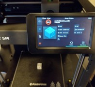

# Klipper Mod for Flashforge Adventurer 5M (Pro)

This is an *unofficial* mod to run Moonraker, custom Klipper, Mainsail & Fluidd on the Flashforge ADM5 (Pro) 3D printers and unlock the full power of open source software.

*This mod is currently in beta stage.* Many features are implemented already but they need to be tested thoroughly and polished a bit by early adopters.

Klipper Mod for the ADM5 is designed to be fully removable and not break any functions of the stock software. *If you install it, then please be aware, that you risk to loose your warranty or damage the printer. Proceed at your own risk if you want to use this mod!*

## Feature Overview
- [Klipper](https://www.klipper3d.org/) 0.11 -- with improved configuration and default macros
- [Moonraker](https://github.com/Arksine/moonraker) on port 7125
- [Mainsail](https://docs.mainsail.xyz/) on port 4000
- [Fluidd](https://docs.fluidd.xyz/) on port 4001
- [KlipperScreen](https://klipperscreen.readthedocs.io/en/latest/) -- separate preview build
- Camera streaming via [ustreamer](https://github.com/pikvm/ustreamer) on port 8080
- Network access: Ethernet LAN and WiFi via [iwd](https://iwd.wiki.kernel.org/)
- Customized Linux environment based on [Buildroot](https://buildroot.org/)
- SSH root access. Login: `root`, Password: `klipper`
- [Audio](https://pypi.org/project/ff-adm5-audio/) via buzzer (can play simple Midis)
- [LCD backlight](https://pypi.org/project/ff-ad5m-backlight/) control 
- Automatic USB flash drive mounting
- "Dual boot" with stock Flashforge software

## Getting Started

Download test latest [release build](https://github.com/xblax/flashforge_adm5_klipper_mod/releases) and read through the documentation for [Installation](docs/INSTALL.md) and [Slicing](docs/SLICING.md). Also make yourself familiar with the [uninstall](docs/UNINSTALL.md) methods, to understand how you can uninstall the mod if you don't like it.

The Klipper Mod is currently provided in two variants: 
- Default variant without on-screen GUI control application
- KlipperScreen variant with fully-fledged [KlipperScreen](docs/KLIPPER_SCREEN.md) installation

If you encounter any issues with the KlipperScreen variant that could be caused by resource exhaustion (mostly system RAM), please try if the issue also occurs with the default variant.

You are welcome to participate int the [GitHub Discussions](https://github.com/xblax/flashforge_adm5_klipper_mod/discussions) or open a new [Issue](https://github.com/xblax/flashforge_adm5_klipper_mod/issues) if you find any bugs.

## Documentation

The documentation is split into several topics:

- [Install](docs/INSTALL.md)
- [Uninstall](docs/UNINSTALL.md)
- [Slicing](docs/SLICING.md)
- [Wifi](docs/WIFI.md)
- [Remote Control](docs/REMOTE_CONTROL.md)
- [Klipper Screen](docs/KLIPPER_SCREEN.md)
- [Linux Environment](docs/LINUX.md)
- [Camera](docs/CAMERA.md)
- [USB](docs/USB.md)
- [LCD](docs/LCD.md)
- [Buzzer](docs/BUZZER.md)